# FS24StartHub - Architecture Overview

## Диаграмма архитектуры проекта

```mermaid
graph TB
    subgraph "Presentation Layer - WinForms"
        Program[Program.cs<br/>Entry Point]
        MainForm[MainForm<br/>Main Window]
        StartForm[StartForm<br/>Launch Dialog]
        StartupItemForm[StartupItemForm<br/>Item Editor]
        Controls[Custom Controls<br/>CustomCheckedListBox<br/>CustomComboBox<br/>etc.]
    end

    subgraph "Core Layer - Domain & Interfaces"
        subgraph "Domain Models"
            AppSettings[AppSettings<br/>Root Settings]
            Config[Config<br/>Configuration Snapshot]
            Career[Career]
            StartupItem[StartupItem<br/>Launch Item]
            CleanupSettings[CleanupSettings]
        end
        
        subgraph "Core Interfaces"
            ISettingsManager[ISettingsManager<br/>Settings Management]
            IAppsManager[IAppsManager<br/>Apps Management]
            ISimLauncherManager[ISimLauncherManager<br/>Launch Orchestrator]
            ILogManager[ILogManager<br/>Logging]
            ISimulatorDetector[ISimulatorDetector<br/>Sim Detection]
        end
        
        subgraph "Storage Interfaces"
            IFileStorage[IFileStorage]
            IJsonStorage[IJsonStorage]
        end
        
        subgraph "Launch System"
            ILaunchTask[ILaunchTask<br/>Task Interface]
            LaunchRequest[LaunchRequest]
            LaunchResult[LaunchResult]
            StepProgress[StepProgress]
        end
    end

    subgraph "Infrastructure Layer - Implementation"
        subgraph "Settings"
            SettingsManager[SettingsManager]
            FirstRunInitializer[FirstRunInitializer]
            SimulatorDetector[SimulatorDetector]
        end
        
        subgraph "Apps Management"
            AppsManager[AppsManager]
            SaveAppsTask[SaveAppsManagerTask]
        end
        
        subgraph "Launcher"
            SimLauncherManager[SimLauncherManager]
            LaunchSimTask[LaunchSimulatorTask]
            StartupItemsGroupTask[StartupItemsGroupTask]
            WaitForExitTask[WaitForSimulatorExitTask]
        end
        
        subgraph "Logging"
            LogManager[LogManager]
            JsonFileLogSink[JsonFileLogSink]
            ConsoleLogSink[ConsoleLogSink]
        end
        
        subgraph "Storage"
            FileStorage[FileStorage]
            JsonStorage[JsonStorage]
        end
        
        subgraph "Helpers"
            Utility[Utility<br/>Helper Methods]
        end
    end

    subgraph "External Dependencies"
        FileSystem[File System<br/>fs24sh.json]
        Simulator[MSFS 2024<br/>Simulator Process]
        ExternalApps[External Apps<br/>Startup Items]
    end

    %% Presentation Layer connections
    Program --> MainForm
    Program --> StartForm
    Program --> SettingsManager
    Program --> AppsManager
    Program --> LogManager
    Program --> FirstRunInitializer
    
    MainForm --> IAppsManager
    MainForm --> ISettingsManager
    MainForm --> ILogManager
    MainForm --> StartupItemForm
    MainForm --> Controls
    
    StartForm --> ISimLauncherManager
    StartForm --> ISettingsManager
    StartForm --> ILogManager
    
    %% Core to Infrastructure
    ISettingsManager -.implements.- SettingsManager
    IAppsManager -.implements.- AppsManager
    ISimLauncherManager -.implements.- SimLauncherManager
    ILogManager -.implements.- LogManager
    IFileStorage -.implements.- FileStorage
    IJsonStorage -.implements.- JsonStorage
    ISimulatorDetector -.implements.- SimulatorDetector
    
    %% Infrastructure internal connections
    SettingsManager --> IFileStorage
    SettingsManager --> IJsonStorage
    SettingsManager --> ILogManager
    SettingsManager --> AppSettings
    
    AppsManager --> ISettingsManager
    AppsManager --> ILogManager
    AppsManager --> StartupItem
    AppsManager --> SaveAppsTask
    
    SimLauncherManager --> IAppsManager
    SimLauncherManager --> ISettingsManager
    SimLauncherManager --> ILogManager
    SimLauncherManager --> LaunchSimTask
    SimLauncherManager --> StartupItemsGroupTask
    SimLauncherManager --> WaitForExitTask
    
    LaunchSimTask -.implements.- ILaunchTask
    StartupItemsGroupTask -.implements.- ILaunchTask
    WaitForExitTask -.implements.- ILaunchTask
    SaveAppsTask -.implements.- ILaunchTask
    
    LogManager --> JsonFileLogSink
    LogManager --> ConsoleLogSink
    
    JsonStorage --> IFileStorage
    
    FirstRunInitializer --> ISimulatorDetector
    FirstRunInitializer --> IFileStorage
    FirstRunInitializer --> IJsonStorage
    
    SimulatorDetector --> Utility
    LaunchSimTask --> Utility
    WaitForExitTask --> Utility
    
    %% External connections
    FileStorage --> FileSystem
    JsonStorage --> FileSystem
    LaunchSimTask --> Simulator
    StartupItemsGroupTask --> ExternalApps
    WaitForExitTask --> Simulator

    %% Styling
    classDef presentation fill:#e1f5ff,stroke:#0288d1,stroke-width:2px
    classDef core fill:#fff3e0,stroke:#f57c00,stroke-width:2px
    classDef infrastructure fill:#f3e5f5,stroke:#7b1fa2,stroke-width:2px
    classDef external fill:#e8f5e9,stroke:#388e3c,stroke-width:2px
    
    class Program,MainForm,StartForm,StartupItemForm,Controls presentation
    class AppSettings,Config,Career,StartupItem,CleanupSettings,ISettingsManager,IAppsManager,ISimLauncherManager,ILogManager,ISimulatorDetector,IFileStorage,IJsonStorage,ILaunchTask,LaunchRequest,LaunchResult,StepProgress core
    class SettingsManager,FirstRunInitializer,SimulatorDetector,AppsManager,SaveAppsTask,SimLauncherManager,LaunchSimTask,StartupItemsGroupTask,WaitForExitTask,LogManager,JsonFileLogSink,ConsoleLogSink,FileStorage,JsonStorage,Utility infrastructure
    class FileSystem,Simulator,ExternalApps external
```



## Описание слоев

### 1. **Presentation Layer (WinForms)** 🎨
- **Program.cs** - точка входа, настройка DI
- **MainForm** - главное окно управления startup items
- **StartForm** - диалог запуска симулятора
- **StartupItemForm** - редактор элементов запуска
- **Custom Controls** - пользовательские UI компоненты

### 2. **Core Layer (Domain & Interfaces)** 🎯
Определяет бизнес-логику и контракты:

#### Domain Models
- **AppSettings** - корневые настройки приложения
- **Config** - снимки конфигураций
- **StartupItem** - элементы для автозапуска
- **Career** - карьерные режимы
- **CleanupSettings** - настройки очистки

#### Core Interfaces
- **ISettingsManager** - управление настройками
- **IAppsManager** - управление приложениями для запуска
- **ISimLauncherManager** - оркестрация процесса запуска
- **ILogManager** - логирование
- **ISimulatorDetector** - обнаружение симулятора
- **IFileStorage / IJsonStorage** - хранилище данных
- **ILaunchTask** - интерфейс задач запуска

### 3. **Infrastructure Layer (Implementation)** ⚙️
Реализация интерфейсов из Core:

#### Settings
- **SettingsManager** - управление fs24sh.json
- **FirstRunInitializer** - инициализация при первом запуске
- **SimulatorDetector** - поиск установленного симулятора

#### Apps Management
- **AppsManager** - управление списком приложений
- **SaveAppsManagerTask** - сохранение перед запуском

#### Launcher Pipeline
- **SimLauncherManager** - выполняет последовательность задач
- **LaunchSimulatorTask** - запуск симулятора
- **StartupItemsGroupTask** - запуск группы приложений
- **WaitForSimulatorExitTask** - ожидание завершения

#### Logging
- **LogManager** - менеджер логов
- **JsonFileLogSink** - запись в JSON файл
- **ConsoleLogSink** - вывод в консоль (DEBUG)

#### Storage
- **FileStorage** - работа с файловой системой
- **JsonStorage** - сериализация/десериализация JSON

## Паттерны проектирования

### 1. **Dependency Injection**
```csharp
// Program.cs
ISettingsManager settingsManager = new SettingsManager(baseFolderPath, fileStorage, jsonStorage, logManager);
IAppsManager appsManager = new AppsManager(settingsManager, logManager);
```

### 2. **Repository Pattern**
- `ISettingsManager` - работа с настройками
- `IAppsManager` - работа с коллекцией StartupItems
- `IFileStorage` / `IJsonStorage` - абстракция хранилища

### 3. **Strategy Pattern**
- `ILaunchTask` - различные стратегии выполнения задач запуска

### 4. **Chain of Responsibility**
- `SimLauncherManager` - выполняет цепочку задач последовательно

### 5. **Observer Pattern**
- `SettingsManager.SettingsChanged` / `SettingsReloaded`
- `AppsManager.DataChanged`

### 6. **Facade Pattern**
- `ISimLauncherManager` - упрощает сложный процесс запуска

## Потоки данных

### Поток запуска симулятора
```
User clicks Start 
  → StartForm.btnStart_Click
  → SimLauncherManager.LaunchAsync
    → SaveAppsManagerTask
    → StartupItemsGroupTask (Before)
    → LaunchSimulatorTask
    → StartupItemsGroupTask (After)
    → WaitForSimulatorExitTask (if KeepAppOpen)
  → LaunchResult returned
  → StartForm shows result
```

### Поток управления настройками
```
Program.Main
  → FirstRunInitializer.Initialize
    → SimulatorDetector.DetectSimulator
    → Create default fs24sh.json
  → SettingsManager.Load
  → AppsManager initialized
  → MainForm loaded
```

### Поток редактирования элементов
```
MainForm → User edits item
  → StartupItemForm shown
  → User saves
  → AppsManager.UpdateStartupItem
  → AppsManager.DataChanged fired
  → MainForm.LoadStartupItems
  → UI updated
```

## Ключевые компоненты

### AppSettings (Root Model)
```
AppSettings
├── Language
├── SimPath, SimType, PackageFamilyName, SimExePath
├── LaunchTimeoutSeconds
├── CurrentCareerId, CurrentConfigId
├── CleanupSettings
├── Careers[]
├── Configs[]
└── StartupItems[]
```

### Launch Pipeline Tasks
1. **SaveAppsManagerTask** - сохраняет изменения
2. **StartupItemsGroupTask (Before)** - запускает приложения до симулятора
3. **LaunchSimulatorTask** - запускает MSFS 2024
4. **StartupItemsGroupTask (After)** - запускает приложения после симулятора
5. **WaitForSimulatorExitTask** - ждет закрытия симулятора (опционально)

## Зависимости проектов

```
FS24StartHub.App.WinForms
  ├─> FS24StartHub.Infrastructure
  └─> FS24StartHub.Core

FS24StartHub.Infrastructure
  └─> FS24StartHub.Core

FS24StartHub.Core
  └─> (no dependencies)
```

## Технологии

- **.NET 9** - целевой фреймворк
- **WinForms** - UI фреймворк
- **System.Text.Json** - сериализация JSON
- **System.Diagnostics.Process** - управление процессами

---

*Диаграмма создана автоматически на основе анализа кода проекта FS24StartHub*
