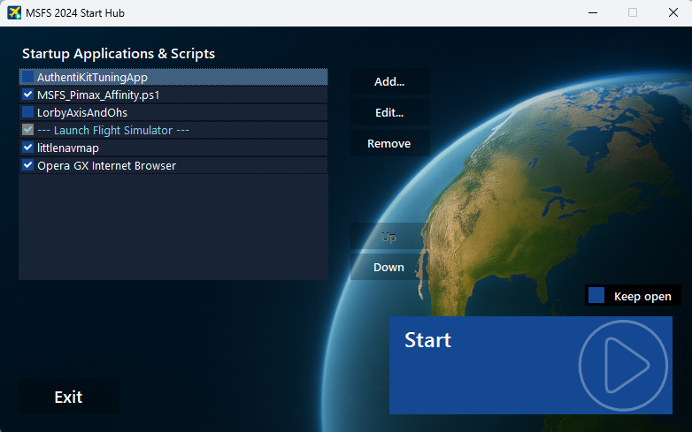

# MSFS 2024 Start Hub

**MSFS 2024 Start Hub** is a lightweight launcher that automatically starts Microsoft Flight Simulator 2024 along with any required utilities, tools, and scripts. It streamlines pre‑flight preparation and removes the need to manually launch multiple applications every time.

---

## ✈️ Features

- Automatically launches Microsoft Flight Simulator 2024  
- Launches any number of external applications alongside MSFS  
- Support for EXE, COM, BAT, CMD, and PowerShell (PS1) files  
- Enable or disable items in the startup list  
- Control the launch order — applications can be started before or after MSFS depending on their position in the list  
- “Keep open” mode to keep the launcher running after startup (future versions may include in‑game monitoring)  
- Clean, lightweight, and intuitive user interface

---

## 📸 Screenshot

---

## 🚀 Installation

1. Download the latest installer in the **Releases** section.  
2. Run the installer and follow the on-screen instructions.

---

## 🧭 Usage

1. Manage the list of applications or scripts you want to launch together with MSFS using the Add/Edit/Remove buttons  
2. Arrange the launch order using the Up/Down buttons  
3. Enable the items you want to include in the sequence for each specific start  
4. Adjust the before/after start delay, display name, and other options using the Add/Edit Startup Item dialog  
5. Enable “Keep open” if you want the launcher to remain running after the simulator startup  
6. Press **Start** — the launcher will run each enabled item in the order shown

---

## 📂 Requirements

- Windows 10 or Windows 11  
- Microsoft Flight Simulator 2024 installed

---

## 📝 Known Limitations

- MSFS startup time varies significantly depending on system performance; if the simulator takes longer to appear, the launch timeout can be adjusted in the configuration file  
- When MSFS performs an update before launching, the simulator process may not appear for an extended period; increasing the timeout may help, although it is not recommended since such cases are rare  
- Some antivirus software may warn about launching scripts (BAT, CMD, PS1)
- When both MSFS 2020 and MSFS 2024 are installed, the launcher may detect the wrong version; this will be fixed in the next update

---

## 📣 Feedback

If you encounter issues or have suggestions, please open an Issue on GitHub.

---

## 📄 License
This project is licensed under the MIT License.
See the LICENSE file for details.

---

## 🤝 Contributions
External pull requests are not accepted.
If you want to report a problem or suggest an improvement, please open an Issue.

---

## ☕ Support

If you'd like to support MSFS 2024 Start Hub, you can do so here:

👉 [Donate via PayPal](https://www.paypal.com/donate/?hosted_button_id=KZFTHJEKN639N)
